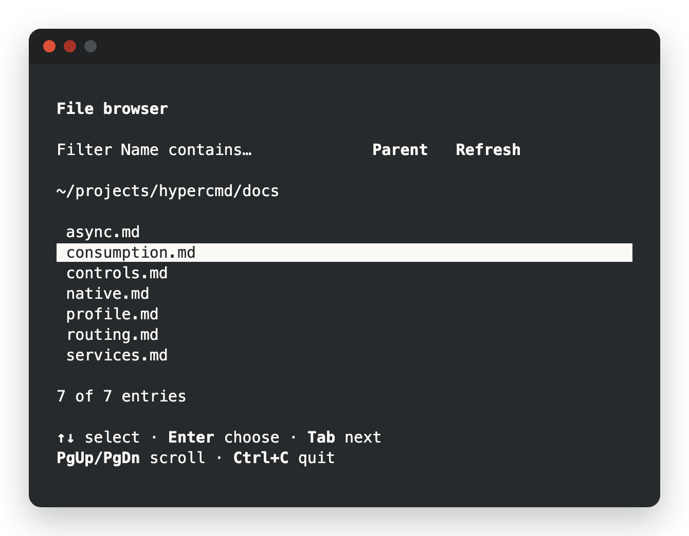

<p>
  <picture>
    <source media="(prefers-color-scheme: dark)" srcset="assets/brand/hypercmd-horizontal-dark.svg">
    
  </picture>
</p>

# Build terminal apps with HTML and Rust

Write your terminal UI in HTML files. Keep state and logic in Rust. No widget trees built by hand, and no markup inside Rust macros.

hypercmd is a terminal renderer for [fusor](https://github.com/fusor-rs/fusor). fusor compiles your HTML and Rust; hypercmd lays the result out in terminal cells, handles the keyboard and keeps the screen in sync. When a signal changes, the bindings that read it run again and the next frame shows the result.

**In development · v0.1**: this is experimental software. APIs will change; don't rely on it for production yet. See [status and known limitations](#status-and-known-limitations).

[Get started](#get-started) · [How it works](#how-it-works) · [Examples](#examples) · [Documentation](#documentation) · [Status](#status-and-known-limitations) · [Contributing](CONTRIBUTING.md)

<p align="center">
  
</p>

## A terminal app in two files

The view is an HTML file. Bindings and event handlers are Rust expressions:

```html
<!-- ui/app.html -->
<App state="{{ Counter::new() }}">
  <main>
    <h1>Counter</h1>
    <p>Count: {{ state.count.get() }}</p>
    <div class="actions">
      <button on:click="state.increment()">Increment</button>
      <button on:click="state.count.set(0)">Reset</button>
    </div>
  </main>
</App>
```

The Rust module owns the state, includes the HTML with `template!` and runs the app:

```rust
// src/main.rs
use fusor::{Signal, signal};

struct Counter {
    count: Signal<i32>,
}

impl Counter {
    fn new() -> Self {
        Self { count: signal(0) }
    }

    fn increment(&self) {
        self.count.update(|n| *n += 1);
    }
}

fusor::template!(backend = "hypercmd", "ui/app.html");

fn main() -> Result<(), hypercmd::Error> {
    hypercmd::native::run(hypercmd_app()?)
}
```

`<App>` makes the struct's fields and methods available as `state` and generates `hypercmd_app()`. Tab moves focus between the buttons; Enter or Space presses one. The paragraph reads the `count` signal, so its text updates when the count changes. The compiler checks the expressions in the HTML along with the rest of the module. A small stylesheet lays the buttons out in a row:

```css
/* ui/terminal.css */
main { padding: 1ch; gap: 1ch; }
.actions { flex-direction: row; gap: 1ch; }
```

## Get started

hypercmd runs on macOS and Linux. To build apps you need Rust 1.85 or newer, installed with [rustup](https://rustup.rs). Then install the CLI:

```sh
curl -fsSL https://raw.githubusercontent.com/fusor-rs/hypercmd/main/install.sh | sh
```

The installer downloads the latest release, verifies its checksum, and puts `hypercmd` in `.hypercmd/bin` under your home directory; it prints the line to add to your `PATH`. The script is [install.sh](install.sh) if you want to read it first. With Rust installed, `cargo install hypercmd-cli` works too.

Create and run an app:

```sh
hypercmd new my-app
cd my-app
hypercmd run
```

`hypercmd new` writes the counter above and checks that it builds. Edit
`ui/app.html` for the screen and `src/main.rs` for its state, then `hypercmd run`
again. See the [CLI reference](docs/cli.md) for commands and options.

### Author an application

`hypercmd new` sets up an ordinary Cargo package. To add hypercmd to an existing one, depend on the runtime and the build helper, and declare the package's templates and styles:

```toml
[dependencies]
hypercmd = "=0.1.0"
fusor = { package = "fusor-core", version = "=0.1.4", default-features = false }
fusor-components = { version = "=0.1.4", default-features = false }

[build-dependencies]
hypercmd-build = "=0.1.0"

[package.metadata.hypercmd]
entry = "ui/app.html"        # the <App> template
templates = ["ui"]           # directories of component templates
styles = ["ui/terminal.css"]
```

Compile the templates from `build.rs`:

```rust
fn main() -> Result<(), Box<dyn std::error::Error>> {
    hypercmd_build::compile_app()
}
```

Reusable components can also be mounted as a root with `hypercmd::mount::<Component>(inputs)`.

To run the examples from a checkout, use [`just`](https://github.com/casey/just): `just demo` opens the file browser in the current folder.

## How it works

- **HTML stays HTML.** Components use native markup with Rust expressions for text, attributes, conditions, lists, routes and events. fusor's compiler lowers them; rustc checks them.
- **Updates follow signal reads.** A binding tracks the signals it reads and updates its own node. hypercmd lays out and paints a frame only when the scene changed.
- **CSS for the terminal.** A bounded stylesheet profile: flexbox layout, `ch` and percentage sizes, padding, gaps, colors, emphasis and scrollable overflow. Unsupported markup or CSS fails at build time instead of rendering differently.
- **Keyboard first.** Focus order, Tab and arrow navigation, multiline grapheme-aware editing, bracketed paste, mouse scrolling and visible focus come built in.
- **Ownership handles cleanup.** Removing a view disposes its listeners, stops its tasks and timers, and asks its background workers to cancel. The terminal is restored on exit, on panic and around Ctrl+Z.
- **One component, two renderers.** A library can compile the same HTML and Rust for the terminal and for fusor's browser renderer.

## Examples

- [File browser](examples/file-browser/): folders and text previews, filtering, routing between screens and filesystem reads in background workers.
- [Job inspector](examples/job-inspector/): routing, async views, timers and a reusable row component.
- [Shared job controls](examples/job-controls/): one component used unchanged by a terminal app and a browser app.

## Documentation

The Markdown guides also power a site through
[`docs-base`](https://github.com/fusor-rs/docs-base).
The [landing page](apps/landing/README.md) and docs share a browser workspace.
Run `just site`, then `just preview` to serve both on port 4187.
See [the site guide](apps/docs/README.md).

| Guide | Covers |
| --- | --- |
| [CLI reference](docs/cli.md) | Installation, creating apps, checks, running and building |
| [HTML and CSS reference](docs/profile.md) | Supported HTML, CSS, layout, scrolling and Unicode policy |
| [Controls](docs/controls.md) | Keyboard, focus, buttons, text and checkbox bindings |
| [Async views](docs/async.md) | `Async`/`Await`, coherent publication and cancellation |
| [Routing](docs/routing.md) | Screens, nested views and in-memory history |
| [Services](docs/services.md) | Owner-scoped tasks, timers and background workers |
| [Native execution](docs/native.md) | Terminal session, signals and resource limits |
| [Consumption](docs/consumption.md) | Packaging, shared components and browser reuse |

## Status and known limitations

hypercmd is v0.1 and experimental. Until 1.0, each minor release may change the HTML profile and the Rust APIs.

### Platform status

| Platform or capability | Status |
| --- | --- |
| macOS native | Automated OS PTY coverage |
| Linux native | CI gate |
| Windows native | Execution unavailable |
| Browser component reuse | Chromium acceptance gate |
| Non-browser Wasm host | Unimplemented |
| Accessibility | Keyboard operation and visible focus; screen-reader testing pending |
| Terminal emulators | Manual compatibility testing pending |

**Not supported yet:**

- Margins, positioning, grids, merged table cells, media and SVG. See the [terminal profile](docs/profile.md) for the exact subset.
- Nested `<Async>` boundaries, and editable controls or router outlets inside an async view.
- East Asian ambiguous-width characters as two cells; they measure as one.

## How is this different from Ratatui?

[Ratatui](https://github.com/ratatui/ratatui) is an immediate-mode library: your code draws widgets into a buffer every frame and handles events itself. hypercmd retains a scene built from HTML templates, updates it through signals, and owns layout, focus and input. It uses Ratatui's buffer and styles for terminal output.

## How is this different from Ink and Textual?

[Ink](https://github.com/vadimdemedes/ink) renders React components in the terminal with flexbox layout, in JavaScript. [Textual](https://github.com/Textualize/textual) is a Python framework with widgets styled by its own CSS dialect. hypercmd shares their ideas of flexbox and CSS in the terminal, but components are HTML templates backed by Rust structs, compiled and type-checked ahead of time, with fine-grained signals updating individual nodes.

## Contributing

hypercmd is an open source project in early development. The [contributing guide](CONTRIBUTING.md) covers the setup, checks and workflow. The runtime and build helper live in `crates/`; runnable applications live in `examples/`.

hypercmd is built with the help of AI tools, mainly Claude Code, under the same rules the project asks of contributors: see [Using AI tools](CONTRIBUTING.md#using-ai-tools).

## License

Licensed under the [MIT License](LICENSE).
